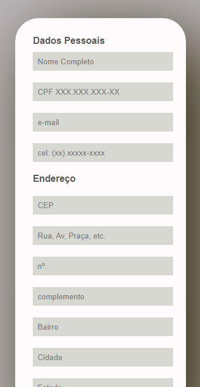
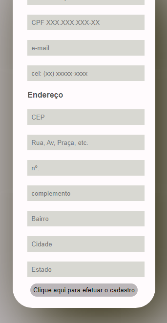
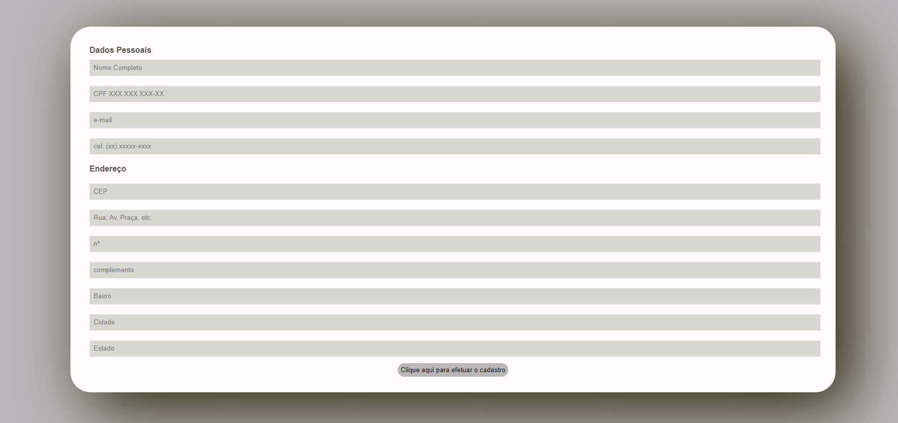

# Página de Cadastro

DEPLOY: https://pagcadastro.netlify.app

# Sobre o projeto

Trata-se de uma página de cadastro com funções de validação do preenchimento dos campos (input) e de preenchimento automático do endereço a partir do preenchimento do CEP.
A intenção da página era a de aprofundar mais os conhecimentos de Javascript, o que de fato ocorreu, tendo em vista a necessidade de se criar mais funções.
A página é responsiva.

## Layout mobile
 

## Layout web

# Tecnologias utilizadas

## Front end
- HTML / CSS / JS / 

# Autor

Giovaani Affornalli Feltrin

https://www.linkedin.com/in/giovanni-a-feltrin/
